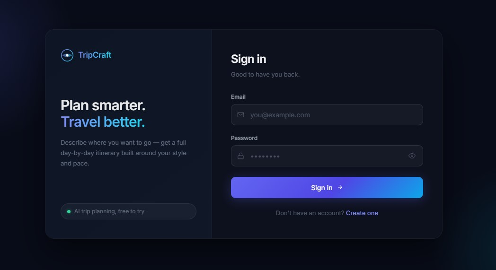
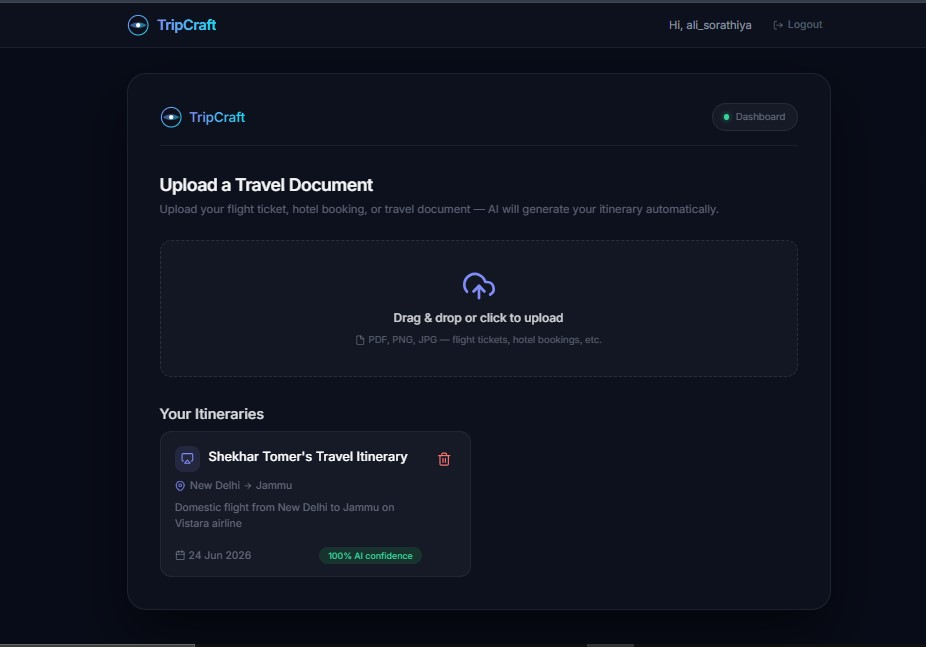
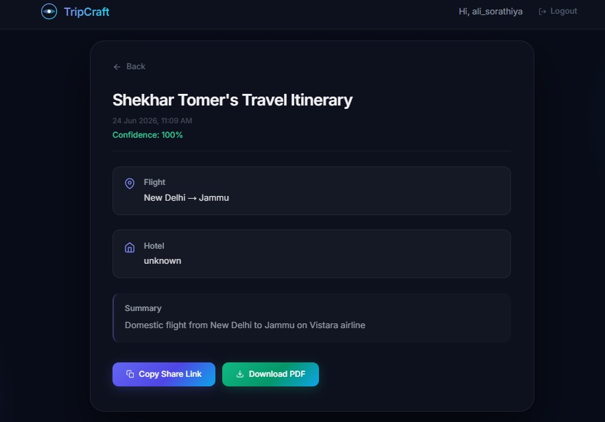

# TripAI — AI-Powered Travel Itinerary Generator

A MERN-based web application that lets users upload travel booking documents (flight tickets, hotel bookings) and automatically generates a structured AI-powered itinerary using OCR + LLM extraction.

Built as a submission for the **Junior Full Stack Developer (MERN + AI)** assignment — Orbitra Technologies / Trrip.

---

## ✨ Features

- **JWT Authentication** — Register, Login, OTP email verification, access + refresh token flow with session management
- **Document Upload** — Drag-and-drop upload (PDF, PNG, JPG) of travel booking documents
- **OCR + PDF Parsing** — Extracts raw text from images (Tesseract.js) and PDFs (pdf-parse)
- **AI Itinerary Generation** — Sends extracted text to an LLM (via OpenRouter) which returns a structured itinerary (flight, hotel, summary, confidence score)
- **Itinerary History** — Logged-in users can view all previously generated itineraries
- **Shareable Itineraries** — Each itinerary gets a unique public share link (no login required to view)
- **Download as PDF** — Export any itinerary as a downloadable PDF (client-side, via jsPDF)
- **Cloud Storage** — Uploaded documents stored on Cloudinary

---
## 📸 Application Preview

### Authentication



### Dashboard & Document Upload



### AI Generated Itinerary



---

## 🏗️ Architecture Highlights

- Service-layer architecture for separation of concerns
- JWT access token + refresh token authentication
- Session-based token management
- OTP email verification using Nodemailer + Gmail OAuth2
- OCR pipeline for image documents using Tesseract.js
- PDF text extraction using pdf-parse
- AI-powered itinerary generation using OpenRouter LLMs
- Cloudinary-based document storage
- Public shareable itinerary links
- Client-side PDF export functionality

---

## 🔄 Application Flow

```text
User Registration
        ↓
Email OTP Verification
        ↓
Login
        ↓
Upload Travel Document
(PDF / Image)
        ↓
OCR / PDF Parsing
        ↓
Text Extraction
        ↓
AI Processing
(OpenRouter LLM)
        ↓
Structured Travel Data
        ↓
AI Itinerary Generation
        ↓
Save to MongoDB
        ↓
History / Sharing / PDF Export
```

---

## 🎯 Assignment Requirements Mapping

| Requirement | Status |
|------------|---------|
| Authentication | ✅ Implemented |
| Travel Document Upload | ✅ Implemented |
| PDF Support | ✅ Implemented |
| Image Support | ✅ Implemented |
| Data Extraction | ✅ Implemented |
| AI Processing | ✅ Implemented |
| AI Itinerary Generation | ✅ Implemented |
| MongoDB Storage | ✅ Implemented |
| Itinerary History | ✅ Implemented |
| Shareable Itineraries | ✅ Implemented |
| Responsive React UI | ✅ Implemented |
| Cloud Storage | ✅ Implemented (Cloudinary) |
| Drag & Drop Upload | ✅ Implemented |
| Logout From All Devices | ✅ Bonus |
| PDF Export | ✅ Bonus |

---

## 🛠️ Tech Stack

**Frontend**
- React.js (Vite)
- Tailwind CSS v4
- React Router DOM
- Axios (with auto access-token refresh interceptor)
- react-dropzone (drag-and-drop upload)
- react-hot-toast (notifications)
- jsPDF (PDF export)

**Backend**
- Node.js + Express.js
- MongoDB + Mongoose
- JWT (access + refresh tokens), bcrypt
- Multer (file uploads, memory storage)
- Cloudinary (document storage)
- Tesseract.js (OCR for images)
- pdf-parse (PDF text extraction)
- OpenRouter API (LLM-based itinerary generation)
- Nodemailer (OTP emails via Gmail OAuth2)

---

## 📁 Folder Structure
assignment-project/

├── server/

│   ├── src/

│   │   ├── config/         → DB, env config, OpenRouter, Cloudinary clients

│   │   ├── controller/     → auth.controller.js, itinerary.controller.js

│   │   ├── middleware/     → auth.middleware.js, upload.middleware.js

│   │   ├── model/          → user, session, otp, Itinerary models

│   │   ├── routes/         → auth.route.js, itinerary.routes.js

│   │   ├── services/       → cloudinary, pdf, ocr, itinerary (AI), email, textCleaner

│   │   └── utils/          → OTP generator + email template

│   ├── server.js

│   └── package.json

│

└── client/

├── src/

│   ├── api/             → axios.js (interceptors + auto refresh)

│   ├── context/         → AuthContext.jsx

│   ├── components/      → Navbar, ProtectedRoute, UploadBox, ItineraryCard, Loader

│   ├── pages/            → Login, Register, VerifyEmail, Dashboard, ItineraryDetail, SharedItinerary

│   ├── App.jsx

│   └── main.jsx

└── package.json

---

## 🔌 API Endpoints

### Auth
| Method | Endpoint | Description |
|--------|----------|-------------|
| POST | `/api/auth/register` | Register user, sends OTP email |
| GET  | `/api/auth/verify-email` | Verify OTP |
| POST | `/api/auth/login` | Login, returns access token + sets refresh cookie |
| GET  | `/api/auth/get-me` | Get logged-in user info |
| GET  | `/api/auth/refresh-token` | Issue new access token |
| GET  | `/api/auth/logout` | Logout current session |
| GET  | `/api/auth/logout-all` | Logout from all devices |

### Itinerary
| Method | Endpoint | Description |
|--------|----------|-------------|
| POST | `/api/itinerary/upload` | Upload booking doc → OCR/PDF parse → AI itinerary generation |
| GET  | `/api/itinerary/my` | Get logged-in user's itineraries |
| GET  | `/api/itinerary/share/:shareId` | Public — view shared itinerary |

---

## ⚙️ Setup & Installation

### 1. Clone the repo
```bash
git clone <your-repo-url>
cd assignment-project
```

### 2. Backend setup
```bash
cd server
npm install
```

Create a `.env` file in `server/`:
```env
PORT=3000
MONGO_URI=your_mongodb_connection_string
JWT_SECRET_KEY=your_jwt_secret
CLOUDINARY_CLOUD_NAME=your_cloud_name
CLOUDINARY_API_KEY=your_api_key
CLOUDINARY_API_SECRET=your_api_secret
OPENROUTER_API_KEY=your_openrouter_key
GOOGLE_USER=your_gmail_address
GOOGLE_CLIENT_ID=your_oauth_client_id
GOOGLE_CLIENT_SECRET=your_oauth_client_secret
GOOGLE_REFRESH_TOKEN=your_oauth_refresh_token
```

Run server:
```bash
node server.js
```

### 3. Frontend setup
```bash
cd client
npm install
npm run dev
```

By default frontend hits `http://localhost:8000/api` — update `src/api/axios.js` `API_BASE_URL` if backend runs elsewhere.

---

## 🚀 Live Links

- **GitHub Repo:** https://github.com/ali-sorathiya64/ai-travel-itinerary-generator/
- **Live App:** https://travel-itinerary-generator-ai.vercel.app/

---

## 📝 Notes / Known Limitations

- Single itinerary fetch currently done via list-and-filter on `/itinerary/my` (no dedicated `GET /:id` route yet)
- `verify-email` and `logout` use GET with query params instead of POST + body

---

## 🙋 Author

Ali Sorathiya
- GitHub: [github.com/ali-sorathiya64](https://github.com/ali-sorathiya64)
- LinkedIn: [linkedin.com/in/ali-sorathiya](https://linkedin.com/in/ali-sorathiya)